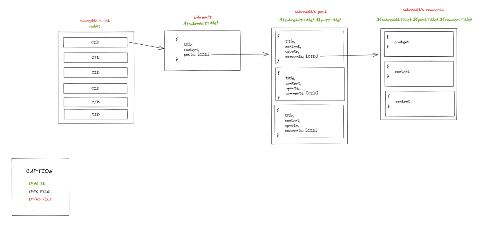

# Reddit-IPFS

Reddit IPFS is a PoC of a the famous social network Reddit built only using distributed storage. It is not meant for production and is only inteded to proove that a Minimum Viable Product can works good and fast.

## Data Structure

We use IPFS and IPNS to create the data structure with so far not a recursive data structure like Reddit does for comments of comments etc ...

Here is a schema of how it works:

  

The IPFS ID is the key we use to create a IPNS file to have a one and only file